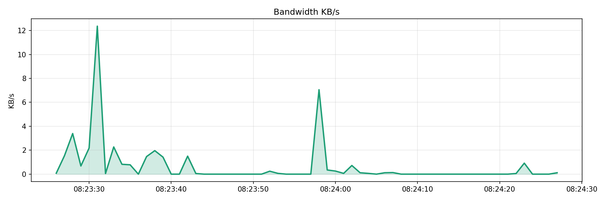
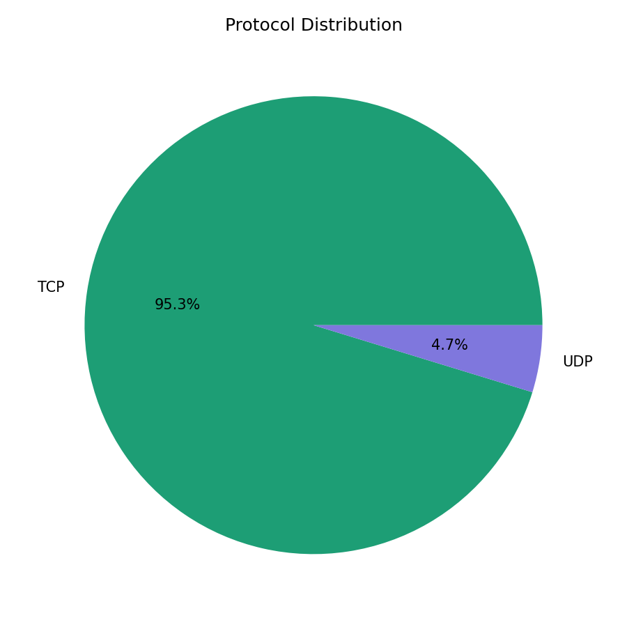
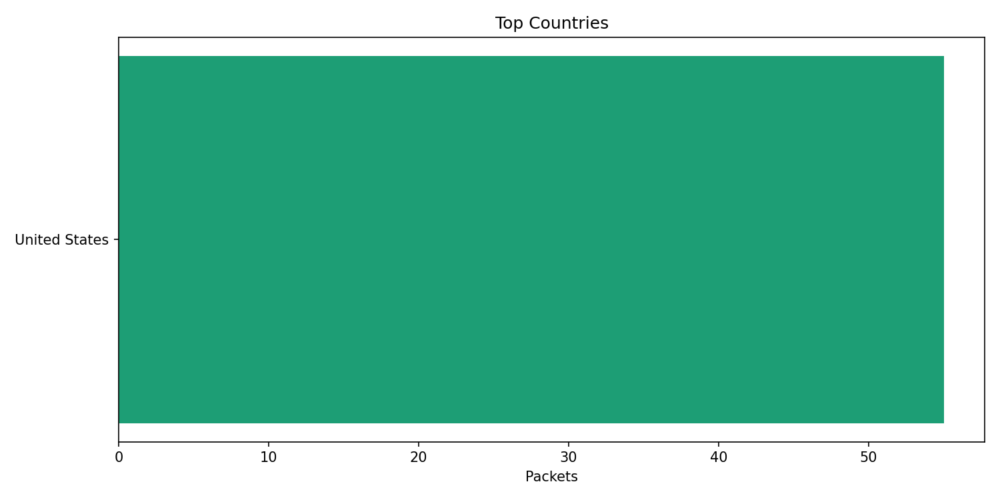
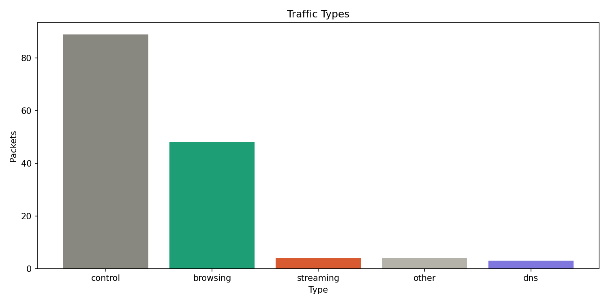

# 🛡️ NetGuard — Intelligent Network Traffic Analyser & IDS

A real-time network traffic analyser and intrusion detection system 
built in Python. Captures live packets, detects 5 attack types, 
classifies traffic using ML, maps connections on a world map, and 
displays everything on a live web dashboard.

## Features

- **Live packet capture** using Scapy
- **5 attack detectors**: SYN flood, Port scan, Brute force, 
  ARP spoofing, DNS tunneling
- **Threat scoring**: Dynamic LOW / MEDIUM / HIGH rating
- **ML traffic classification**: streaming, browsing, DNS, VoIP
- **GeoIP world map**: shows where your traffic goes
- **Live Streamlit dashboard**: auto-updates every 5 seconds
- **6 auto-generated graphs** on capture completion

## Screenshots

### Live Dashboard

### Top IPs & Countries

### Traffic Classification

## How to run

### Step 1 — Capture traffic
### Step 2 — Open dashboard (new terminal tab)
### Step 3 — Open browser
Go to: http://localhost:8501

### Step 4 — Stop capture
Press Ctrl+C in the netguard terminal.
Graphs and world map generate automatically.

## Attack detectors

| Attack | Detection method | Threshold |
|---|---|---|
| SYN Flood | SYN packets per IP per 5s | > 100 |
| Port Scan | Unique ports per IP | > 15 |
| Brute Force | Attempts on SSH/FTP/RDP | > 20 |
| ARP Spoof | MAC address conflict | Any conflict |
| DNS Tunnel | DNS query length | > 60 chars |

## Project structure

| File | Purpose |
|---|---|
| netguard.py | Packet capture + detection |
| dashboard.py | Live web dashboard |
| demo.py | Attack simulation for testing |
| requirements.txt | Required libraries |
| GeoLite2-City.mmdb | GeoIP database |

## Technologies used

- Python 3.13
- Scapy (packet capture)
- pandas (data analysis)
- matplotlib (graphs)
- Streamlit (web dashboard)
- folium (interactive maps)
- geoip2 (IP geolocation)
- scikit-learn (ML classification)